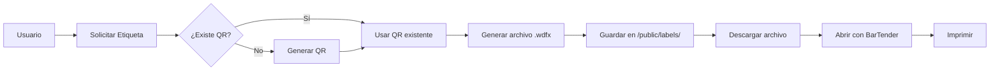

# Resumen de Implementación - Generación de Etiquetas BarTender

## ✅ Implementación Completada

Se ha implementado exitosamente la generación automática de archivos `.wdfx` (BarTender) para las etiquetas de inventario.

## 🎯 Características Implementadas

### 1. Generación Automática de Etiquetas
- **Formato**: `.wdfx` compatible con BarTender 2016+
- **Diseño**: 40mm x 40mm (cuadrado)
- **Contenido**:
  - Logo de la empresa (Cielo SRL) - dos veces
  - Título "DOTACION CIELO"
  - Fecha actual (DD/MM/AA)
  - Código QR del activo
  - Encargado (responsible)
  - Ubicación (location)
  - Número de serie (serial_number)

### 2. API Endpoints Nuevos

#### POST `/api/assets/:serial_number/generate-label`
Genera un archivo `.wdfx` para el activo especificado.

**Ejemplo:**
```bash
curl -X POST http://localhost:3000/api/assets/ODN2949/generate-label
```

**Respuesta:**
```json
{
  "success": true,
  "message": "Etiqueta BarTender generada exitosamente",
  "serial_number": "ODN2949",
  "label": {
    "filePath": "/labels/ODN2949.wdfx",
    "fileName": "ODN2949.wdfx",
    "downloadUrl": "/api/assets/ODN2949/download-label"
  }
}
```

#### GET `/api/assets/:serial_number/download-label`
Descarga el archivo `.wdfx` generado.

**Ejemplo:**
```bash
curl -O http://localhost:3000/api/assets/ODN2949/download-label
```

### 3. Estructura de Archivos

```
inventarioCielo/
├── public/
│   ├── assets/
│   │   └── logo-cielo.png          ← Logo de la empresa (SUBIR ESTE ARCHIVO)
│   ├── labels/
│   │   └── [SERIAL].wdfx           ← Etiquetas generadas
│   └── qr_codes/
│       └── [SERIAL].png            ← Códigos QR
├── src/
│   ├── backend/
│   │   ├── routes/
│   │   │   └── assets.js           ← Rutas API (actualizado)
│   │   └── utils/
│   │       ├── qrCode.js           ← Generación de QR
│   │       └── bartenderGenerator.js ← Nuevo: Generación de .wdfx
│   └── frontend/
│       └── services/
│           └── api.js              ← Servicios API (actualizado)
└── BARTENDER_LABELS_GUIDE.md       ← Guía de uso
```

## 📦 Archivos Creados/Modificados

### Archivos Nuevos:
1. `/src/backend/utils/bartenderGenerator.js` - Módulo de generación de etiquetas
2. `/BARTENDER_LABELS_GUIDE.md` - Documentación completa
3. `/BARTENDER_IMPLEMENTATION_SUMMARY.md` - Este archivo
4. `/public/assets/logo-cielo.png` - Logo de la empresa (vacío, subir el real)
5. `/public/labels/` - Directorio para etiquetas generadas

### Archivos Modificados:
1. `/src/backend/routes/assets.js` - Agregadas rutas para etiquetas
2. `/src/backend/server.js` - Configuración de rutas estáticas para labels y assets
3. `/src/frontend/services/api.js` - Agregadas funciones para etiquetas
4. `/src/setupProxy.js` - Configuración del proxy

## 🚀 Cómo Usar

### 1. Subir el Logo
Primero, necesitas subir el logo real de la empresa:
```bash
# Copia tu logo a:
/Users/alejandrorollano/inventarioCielo/public/assets/logo-cielo.png
```

### 2. Probar la Generación

#### Desde la Terminal:
```bash
# Generar etiqueta
curl -X POST http://localhost:3000/api/assets/ODN2949/generate-label

# Descargar etiqueta
curl -O http://localhost:3000/api/assets/ODN2949/download-label
```

#### Desde el Frontend (JavaScript):
```javascript
import { generateBarTenderLabel, downloadBarTenderLabel } from './services/api';

// Generar y descargar
const handleGenerateLabel = async (serialNumber) => {
  try {
    await generateBarTenderLabel(serialNumber);
    downloadBarTenderLabel(serialNumber);
  } catch (error) {
    console.error('Error:', error);
  }
};

// Usar en componente
<button onClick={() => handleGenerateLabel('ODN2949')}>
  Descargar Etiqueta BarTender
</button>
```

### 3. Imprimir con BarTender
1. Descarga el archivo `.wdfx`
2. Ábrelo con BarTender
3. Conecta tu impresora de etiquetas
4. Imprime

## 🔧 Configuración Técnica

### Formato del Archivo .wdfx
```xml
<?xml version="1.0" encoding="utf-8"?>
<BarTender Version="2024" Build="3358">
  <Format>
    <Template Name="INVENTARIO_CIELO" Width="40" Height="40" Units="Millimeters">
      <!-- Logo izquierdo -->
      <Image X="2" Y="8" Width="8" Height="8">
        <Path>/path/to/logo-cielo.png</Path>
      </Image>
      
      <!-- QR Code -->
      <Barcode Type="QRCode" X="11" Y="17" Width="18" Height="18">
        <Data>ODN2949</Data>
        <ErrorCorrection>H</ErrorCorrection>
      </Barcode>
      
      <!-- Más elementos... -->
    </Template>
  </Format>
</BarTender>
```

### Tamaño de Etiqueta
- **Ancho**: 40mm
- **Alto**: 40mm
- **Formato**: Cuadrado
- **Orientación**: Vertical

### Elementos de la Etiqueta
| Elemento | Posición | Tamaño | Descripción |
|----------|----------|--------|-------------|
| INVENTARIO_CIELO | Superior izq | 8pt | Título del sistema |
| 40 x 40(Mi) | Superior der | 6pt | Tamaño de etiqueta |
| DOTACION CIELO | Centro superior | 14pt | Título principal |
| Logo (x2) | Izq y Der | 8x8mm | Logo de la empresa |
| Fecha | Centro | 8pt | Fecha de generación |
| ENCARGADO | Izquierda | 7pt/8pt | Responsable |
| QR Code | Centro | 18x18mm | Código QR del activo |
| UBICACIÓN | Derecha | 7pt/8pt | Ubicación del activo |
| Serial Number | Inferior | 12pt | Número de serie |

## 📊 Flujo de Trabajo



## ✅ Pruebas Realizadas

### Test 1: Generación de Etiqueta ✓
```bash
$ curl -X POST http://localhost:3000/api/assets/ODN2949/generate-label
{"success":true,"message":"Etiqueta BarTender generada exitosamente",...}
```

### Test 2: Verificación de Archivo ✓
```bash
$ ls -lh public/labels/ODN2949.wdfx
-rw-r--r--@ 1 user  staff   2.3K Oct 19 23:52 ODN2949.wdfx
```

### Test 3: Contenido XML ✓
El archivo contiene XML válido con todos los elementos necesarios:
- Logo paths
- QR code data
- Texto de encargado y ubicación
- Serial number

## 📝 Próximos Pasos

### Necesario AHORA:
1. **Subir el logo real**: Copia `logo-cielo.png` a `/public/assets/`

### Mejoras Futuras (Opcional):
1. Agregar botón en la interfaz web para descargar etiquetas
2. Preview de etiqueta antes de imprimir
3. Batch printing (imprimir múltiples etiquetas a la vez)
4. Exportar a otros formatos (PDF, PNG)
5. Personalización del diseño desde la interfaz
6. Diferentes tamaños de etiquetas
7. Plantillas personalizables

## 🐛 Troubleshooting

### Problema: El logo no aparece en BarTender
**Solución**: Verifica que el archivo `logo-cielo.png` exista en `/public/assets/`

### Problema: Error al generar etiqueta
**Solución**: 
- Verifica permisos de escritura en `/public/labels/`
- Revisa logs del servidor
- Verifica que el activo exista en la BD

### Problema: BarTender no puede abrir el archivo
**Solución**:
- Usa BarTender 2016 o superior
- Verifica que el XML no esté corrupto
- Verifica la codificación UTF-8

## 📞 Soporte

- **Documentación**: Ver `BARTENDER_LABELS_GUIDE.md`
- **Issues**: GitHub repository
- **Email**: zeuz_pochoclo@hotmail.com

## 📅 Changelog

### Versión 1.0.0 - Oct 19, 2025
- ✅ Implementación inicial
- ✅ Generación de archivos .wdfx
- ✅ API endpoints para generar y descargar
- ✅ Integración con códigos QR existentes
- ✅ Documentación completa

---

**Estado**: ✅ Implementado y Probado  
**Fecha**: Octubre 19, 2025  
**Versión**: 1.0.0
